Mu 与 Magic:bit

## 什么是Mu ？
Mu 是一款简单的python集成开发环境，可以帮助用户编译一些控制器和处理器，该软件功能界面简单，打开软件以后可以选择四个模式编辑，支持 PYTHON 3、Pygame Zero、 BBC MICRO: BT、 ADAFRUIT CIRCUITPYTHON，选择一个模式就可以进入到编辑界面，可以直接在软件上编辑代码，也可以通过加载.PY或者是.hex文件到软件上调试，功能非常实用！并且软件提供了一个图形调试器工具。适合中小学生Python学习者。

## Mu 下载安装
Mu下载安装方便，用户可以直接通过   [Mu官网](https://codewith.mu/en/download)  下载适合自己电脑的Mu版本，具体安装过程如图所示                                                                        											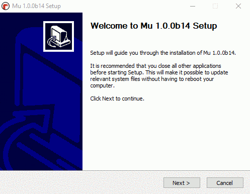

如果需要了解详细的安装说明，可以登录  [Mu安装](https://codewith.mu/en/howto/) 学习

## Mu 的 BBC micro:bit 模式

’‘模式“按钮可以选择相应的编辑模式，在为micro:bit主板编程时，应选择BBC microbit 。

”新建“按钮可以新建编程文件，用来为micro:bit编写python控制程序

”加载“按钮是用来加载电脑中已经保存好的 .py 文件。注意：在安装好Mu后，点击加载，记下加载的文件路径，这个路径就是microbit库文件在电脑的存放路径，在往后的学习中，会多次micro:bit添加库，需要用到该路径把库 放到电脑的这个固定位置

”保存“按钮是用来保存修改过或新建的文件

“刷入”按钮将Python代码下载到连接的micro:bit上(microbit主板的指示灯“闪烁”表示正在下载python程序到micro:bit上)。当micro:bit主板指示灯闪烁时，主板也在删除之前下载的程序。如果下载的代码包含一个错误，micro:bit屏幕会滚动显示错误信息。闪烁的过程大约需要10秒，如下所示：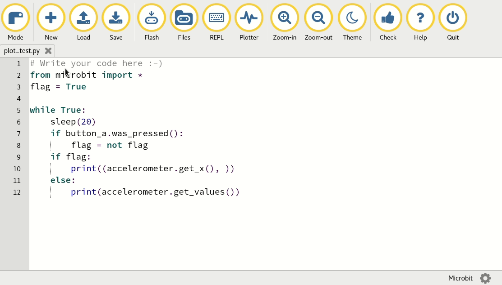

“文件”按钮可以方便地访问、放置、获取和删除设备上的文件。如下图所示，单击“文件”会在文本编辑器和Mu的页脚之间打开两个窗格。左边的窗格列出micro:bit上的所有文件，右边的窗格列出mu_code你电脑上的文件。在每个文件之间拖动文件以复制它们。若要删除micro：bit上的文件，请右击它并选择“Delete”。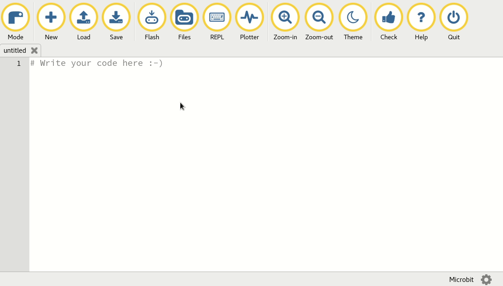 注意：如果点击文件，提示错误，可以重新插拔microbit主板以及重新打开Mu，或者 在代码区输入”import microbit“，然后点击刷入，再次打开文件。 

“REPL”按钮在文本编辑器和Mu的页脚之间创建一个新窗格，连接到MicroPythonREPL关于micro:bit装置。“REPL”这个词是一个缩略语，代表“Read，Value，print，循环”，它简洁地描述了面板为您做了什么。它读取您键入的Python的交互式行，计算这些代码的含义，输出它为您提供的任何结果，然后循环返回以等待您的下一个Python指令。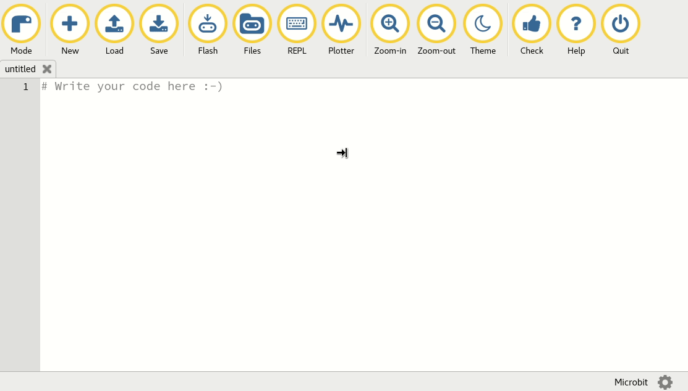
从上面的示例中可以看到，使用MicroPython的REPL就像与Python中的micro：bit进行对话一样。在常规Python脚本中可以做的任何事情，都可以在REPL中完成。这是一种有趣的方法，可以有趣地探索MicroPython在微：BIT上的功能。去吧，玩玩吧！(提示：microPython中内置了大量的复活节彩蛋：bit…。你能找到他们吗？)

“绘图仪”按钮打开了Mu的绘图仪。如果您的micro：bit是通过串行连接输出数字元组，绘图仪将显示它们为一个图形。这对于可视化您可能通过微：位测量的任何数据是非常有用的。有关更多信息，请阅读[穆氏绘图仪教程](https://codewith.mu/en/tutorials/1.0/plotter).

”放大“和”缩小“按钮的作用是用来放大和缩小代码的大小，可以根据需要来调整代码字体的大小

”主题“按钮是用来调整Mu的编程主题风格，可以点击切换不同的背景主题

"检查"按钮是用来检测代码的错误的，在编程程序的过程中，可以通过该按钮检查常规错误，也可以通过刷入后micro:bit屏幕有无提示以及提示信息来更详细的检查代码

”Tidy“按钮是用来调整整个程序的美观性的

”帮助“按钮可以进入Mu官方网站，寻找更详细的软件资料

”退出“按钮是用来退出Mu软件

## Mu 编写micro:bit程序
1、点击”模式“按钮，选择BBC microbit 模式（如果打开软件的时候已经选择BBC microbit模式，此步骤可以忽略)
2、点击"新建"按钮，新建编写文件，编写相应的micro:bit程序
3、点击“保存”按钮，把编写的micro:bit程序保存到相应位置（如果仅仅是临时测试程序可以不用保存）
4、点击”检查“按钮，检查程序有无常规错误。当程序下载完成，如果程序是错误的，micro:bit屏幕也会出现相应错误信息。
4、点击”刷入“按钮，把编写好的micro:bit程序下载到micro:bit主板，micro:bit主板指示灯闪烁表示程序正在下载，当闪烁结束的时候，如果micro:bit屏幕没有错误信息，表示程序下载成功。

## Magic:bit库添加

1、我的程序文件呢？人们有时很容易丢失他们的代码，所以Mu的默认文件位置始终为mu_code，mu_code的路径怎么找呢？当安装好Mu，点击”加载“按钮，加载出来的就是mu_code的文件路径，记住此路径，在以后的学习中需要添加库，就放到电脑的该路径的位置（每个电脑的路径会稍有不同）。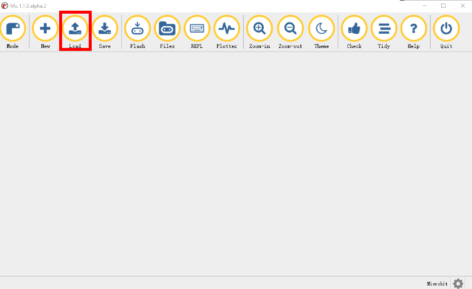点击”加载“按钮

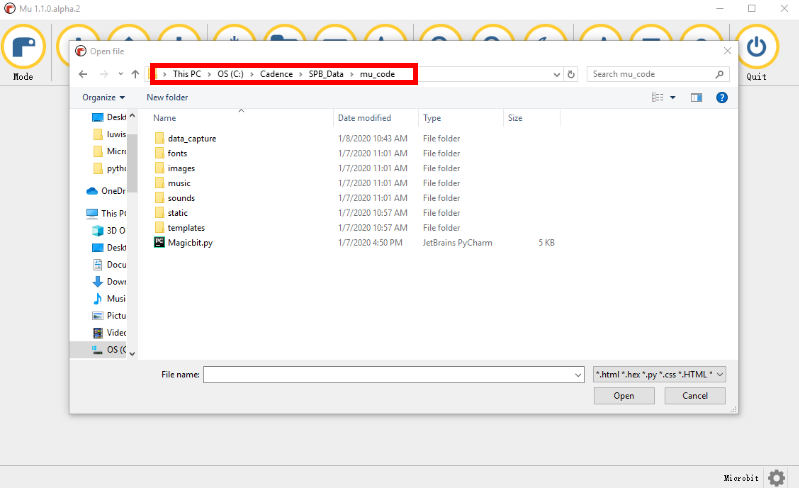记下mu_code路径

2、把Magic:bit库文件复制粘贴到mu_code文件内，结果如图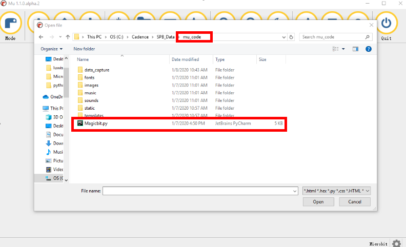

3、打开Mu软件，点击”文件“按钮，通过拖拽，把电脑中的文件拖拽到BBC micro:bit中，当micro:bit主板的指示灯闪烁结束的时候，表示Magic:bit库文件已经添加到micro:bit主板，可以通过from Magicbit import * 来使用Magicbit库了，需要注意的是，在调用库的时候要确保Magicbit库在microbit主板内，因为microbit库文件不是一次下载就永远存在的。

## Magic:bit板载无源蜂鸣器播放音乐
Magic:bit板载一个无源蜂鸣器(默认通过跳线帽接在micro:bit主板 P0 引脚)，可以通过对micro:bit主板编写相应的程序来控制这个无源蜂鸣器播放音乐，在通过Mu编写micropython控制程序之前，需要先了解一下microbit控制音乐的python编写语言  [中文版教程](http://www.qingchuangzhiyi.com/doc/music.html), [英文版教程](https://microbit-micropython.readthedocs.io/en/latest/tutorials/music.html)
例程实验：控制 Magic:bit间隔1S播放 FUNK 音乐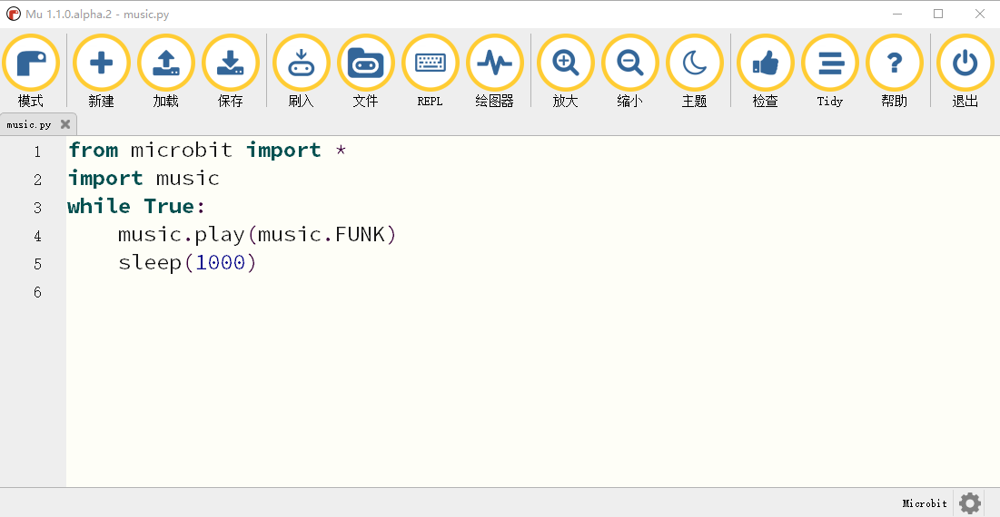

## Magic:bit板载RGB灯闪烁
Magic:bit板载有4颗RGB全彩灯(默认接在micro:bit主板 P16 引脚)，可以通过对micro:bit主板编写相应的程序来控制这4颗RGB全彩灯，BBC micropython控制相应的RGB灯控制，可以通过 [中文版教程](http://www.qingchuangzhiyi.com/doc/neopixel.html) 或 [英文版教程](https://microbit-micropython.readthedocs.io/en/latest/neopixel.html) 学习更多关于如何控制RGB灯的知识
例程实验：控制 Magic:bit板载RGB灯闪烁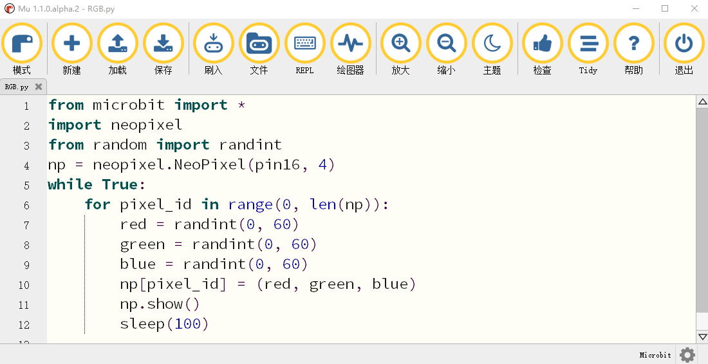

## Magic:bit控制电机转动

Magic:bit设计有四个直流电机接口M1，M2，M3，M4，可以加载Magic:bit库，从而通过Magic:bit扩展板控制直流电机转动。
例程实验：控制四个直流电机转动，实验例程程序如图所示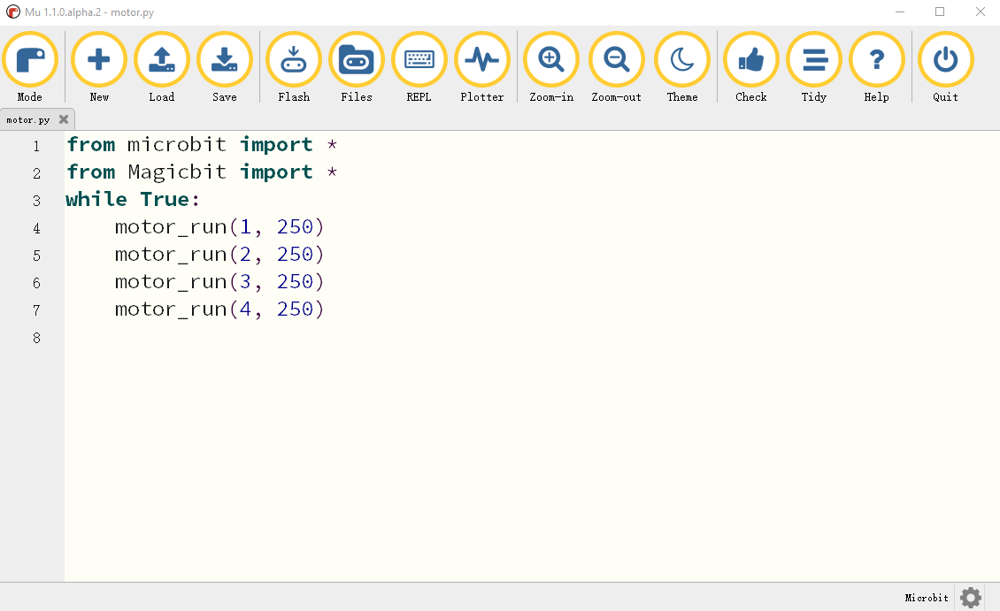

Magic:bit电机控制函数说明：motor_run(index,  speed)     #该函数为直流电机控制函数，index的值为数字1、2、3、4，分别代表Magic:bit扩展板的直流电机接口M1、M2、M3、M4。函数的第二个参数 speed 为速度值，取值范围为-250~250，正负表示旋转方向。例如：假如需要接在扩展板 M2引脚的直流电机速度为 150，那么通过 motor_run(2, 150) 就可以实现。

## Magic:bit控制舵机转动

Magic:bit设计有8个PWM舵机接口S1、S2、S3、S4、S5、S6、S7、S8。可以加载Magic:bit库，从而通过Magic:bit扩展板控制PWM舵机的转动。
例程实验：控制接在S1引脚的PWM舵机在0°和180°位置间隔2S循环转动，实验例程程序如图所示

Magic:bit舵机控制函数说明：servo(index, angle)         #该函数为舵机控制函数，index的值为数字1、2、3、4、5、6、7、8，分别对应Magic:bit扩展板的PWM接口S1、S2、S3、S4、S5、S6、S7、S8。函数的第二个参数 angle 为角度值，取值范围为 0~180。例如：假如需要接在扩展板 S1 引脚的PWM舵机转动到150°位置，那么通过 servo(1, 150) 就可以是实现。

## Magic:bit控制步进电机转动

Magic:bit设计有两个步进电机接口Stepper moto 1、Stepper moto 2。可以加载Magic:bit库，从而通过Magic:bit扩展板控制 28BYJ-48步进电机的转动。
例程实验：控制接在Stepper moto 1引脚的步进电机间隔2S转动90°，实验例程程序如图所示 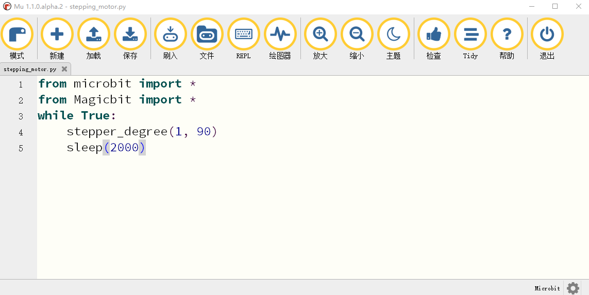

Magic:bit步进电机控制函数说明：stepper_degree(index, degree)       #该函数为步进电机控制函数，index 的值为数字1、2，分别对应Magic:bit扩展板的Stepper moto 1、Stepper moto 2步进电机接口。函数的第二个参数 degree 为步进电机转动角度值，取值范围为 -360~360，正负表示转动方向。例如：假如需要接在Stepper moto 1引脚的步进电机转动 80°，那么通过 stepper_degree(1, 80) 就可以实现。

## Magic:bit控制RGB超声波

Magic:bit设计有一个RGB超声波接口，可以加载Magic:bit库，从而通过Magic:bit扩展板控制 RGB 超声波或者普通超声波，检测前方障碍物的距离。
例程实验：通过RGB超声波检测前方障碍物距离并打印，当点击"刷入"按钮后，立即点击”REPL“按钮，Mu的下面就会打印距离值，实验例程程序如图所示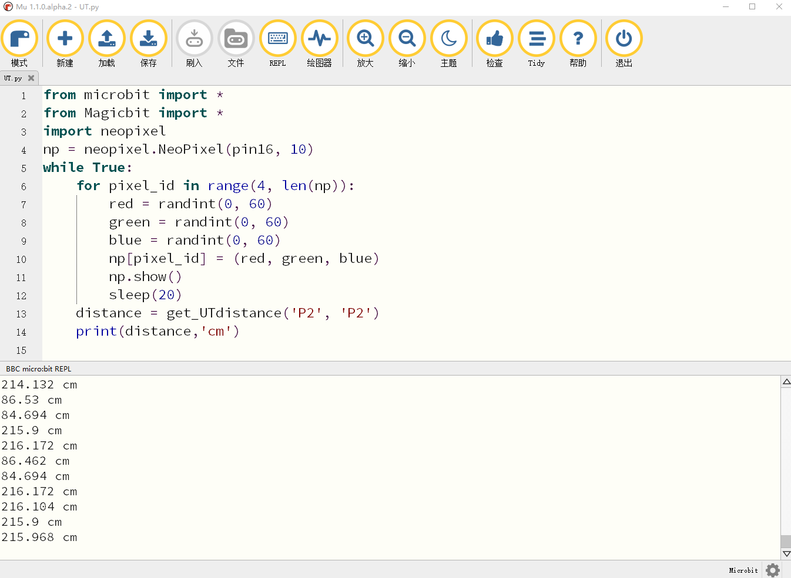

Magic:bit超声波控制函数说明：get_UTdistance(trig, echo)        #该函数为超声波距离检测函数，会返回检测到的前方障碍物距离(cm) 。trig 代表的是超声波的发送引脚，echo 代表的是超声波的接收引脚。trig 与 echo 的取值为字符串’P0‘、’P1‘、’P2‘、’P8‘、’P12‘、’P13‘、’P14‘、’P15‘分别对应扩展板的P0、P1、P2、P8、P12、P13、P14、P15引脚。当使用RGB超声波时，trig 与 echo 均为 ’P2‘；当使用普通超声波时，两个引脚的选择根据实际连接情况进行选择。例如：使用普通超声波，超声波的 echo 引脚接在了扩展板P2 引脚、trig 引脚接在了扩展板的 P8 引脚，那么通过 get_UTdistance(’P8‘, ’P2‘) 就可以实现距离的检测

