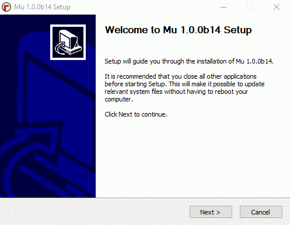
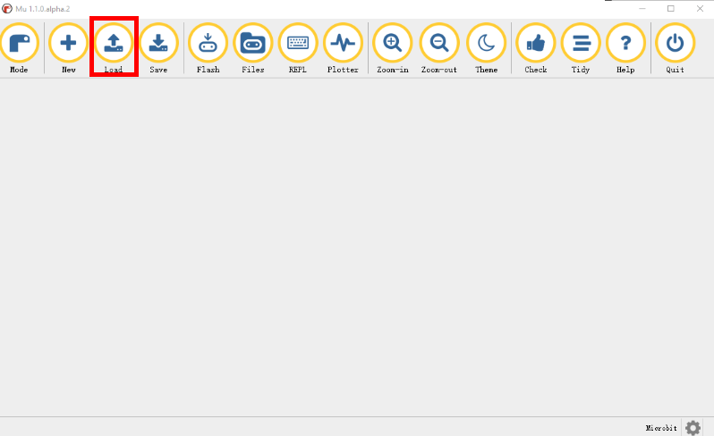

# Mu  and  Magic:bit/Motor:bit python library

## 

method 1. use extern python library 

## Mu download and install
Mu  Easy to download and install, users can directly through   [Mu  official website](https://codewith.mu/en/download)  Download the version of Mu suitable for your computer, the specific installation process is shown in the figure                                                                       											

If you need detailed installation instructions, you can log in  [Mu install](https://codewith.mu/en/howto/) 

## Mu's BBC  micro:bit model

- 'Mode' The button can select the corresponding editing mode, and BBC microbit should be selected when programming the micro:bit motherboard 。
- 'New' The button creates a new programming file to write a python control for micro:bit
- 'Load' The button is used to load the already saved.py file on your computer.Note: after installing Mu, click load and write down the loaded file path, which is the storage path of the microbit library files in the computer. In the future study, micro:bit will be added to the library many times, and this path is needed to put the library in the fixed position of the computer
- 'Save' A button is used to save a modified or newly created file
- 'Flash' The button downloads Python code to the connected micro:bit (the indicator light on the microbit motherboard "flashes" to indicate that you are downloading Python programs to micro:bit).When the micro:bit motherboard indicator flashes, the motherboard is also deleting the previously downloaded programs.If the downloaded code contains an error, the micro:bit screen scrolls the error message.The blinking process takes about 10 seconds, as shown below：
- 'Files' Buttons make it easy to access, place, get, and delete files on the device.As shown in the following figure, clicking file opens two panes between the text editor and the footer of the Mu.The left pane lists all files on micro:bit, and the right pane lists files on your computer with mu_code.Drag files between each file to copy them.To Delete a file on micro: bit, right-click it and select "Delete"。  Note: if you click on the file and an error is prompted, you can re-insert the microbit motherboard and re-open Mu, or enter "import microbit" in the code area, and then click "swipe in" to open the file again.
- 'REPL' The button creates a new pane between the text editor and the Mu footer, connecting to the MicroPythonREPL about the micro:bit device.The word "REPL" is an acronym that stands for "Read, Value, print, loop," and it succinct description of what the panel does for you.It reads the interactive lines of Python you type, calculates the meaning of the code, outputs whatever results it provides you, and loops back to wait for your next Python instruction.
As you can see from the example above, using a MicroPython REPL is like talking to a micro: bit in Python.Anything you can do in a regular Python script can be done in REPL.This is an interesting way to explore MicroPython's capabilities on micro: BIT.Go and play!(hint: there are plenty of Easter eggs built into microPython: bit....Can you find them?
- 'Plotter' The button opens the Mu plotter.If your micro: bit outputs digital tuples over a serial connection, the plotter displays them as a graph.This is useful for visualizing any data that you might measure through the micro: bit.For more information, read [Moo's plotter tutorial](https://codewith.mu/en/tutorials/1.0/plotter).
- 'Zoom-in' and 'Zoom-out' The function of the button is to enlarge and reduce the size of the code, you can adjust the size of the code font as needed
- 'Theme' The button is used to adjust the programming theme style of Mu, and can be clicked to switch between different background themes
- 'Check' The button is used to detect errors in the code. During the programming process, the button can be used to check the general errors, and the micro:bit screen can also be swiped-in to check the code in more detail
- 'Tidy' Buttons are used to adjust the aesthetics of the entire program
- 'Help' The button can enter the official Mu website to find more detailed software information
- 'Quit' The button is used to exit the software

## Write micro:bit program
- Click the 'Mode' button and select BBC microbit mode (this step can be ignored if BBC microbit mode is already selected when you open the software)
- Click the 'New' button, create a new write file, and write the corresponding micro:bit program
- Click the 'Save' button to save the micro:bit program to the corresponding location (if it is only a temporary test program, it can be saved)
- Click the 'Check' button to check for routine errors.When the program is downloaded, if the program is wrong, the micro:bit screen will also display an error message
- Click the 'Flash' button to download the programmed micro:bit program to the micro:bit motherboard. The micro:bit motherboard indicator flashes to indicate that the program is being downloaded. When the flashing ends, if there is no error message on the micro:bit screen, the program downloads successfully.

## Add the Magic: bit library

-  Where are my program files?People can easily lose their code sometimes, so the default file location of Mu is always mu_code, how do you find the path of mu_code?When the Mu is installed, click the "load" button, and the file path of mu_code will be loaded. Remember this path. If you need to add the library in the future study, put it in the location of this path on the computer (the path of each computer will be slightly different).

    Click the "Load" button

     

Write down the mu code path

- Copy and paste the Magic:bit library file into the mu_code file, as shown below


- Open Mu software, click on the "file" button, drag and drop, the computer files in the drag and drop to the BBC micro: bit, when micro: bit the mainboard of the end of the indicator lights flashing, said Magic: bit library files have been added to the micro: bit the mainboard, can pass the    from Magicbit import *    to use the Magicbit library, it is important to note that at the time of call library to ensure Magicbit library within microbit motherboard,Because microbit library files don't last forever after a single download.

## The onboard passive buzzer plays music
Magic:bit contains a passive buzzer (connected to micro:bit motherboard P0 pin by default via jumper cap). You can control this passive buzzer to play music by writing corresponding programs on micro:bit motherboard. Before writing micropython control program through Mu, you need to know the python programming language of microbit control music [English version](https://microbit-micropython.readthedocs.io/en/latest/tutorials/music.html)
Routine experiment: controlled Magic:bit interval 1S to play FUNK music  

## Magic:bit onboard RGB lights flash
Magic:bit board is equipped with 4 RGB full color lights (connected to micro:bit motherboard P16 pins by default). These 4 RGB full color lights can be controlled by programming the micro:bit motherboard  [English version](https://microbit-micropython.readthedocs.io/en/latest/neopixel.html) Learn more about how to control RGB lights
Routine experiment: control Magic:bit on-board RGB lamp flashing 

## Magic:bit controls motor rotation

Magic:bit is designed with four dc motor interfaces M1, M2, M3 and M4, which can load the Magic:bit library and control the dc motor rotation through the Magic:bit expansion board.
Routine experiment: control the rotation of four dc motors. The routine program is shown in the figure 

Motor control function description：**`motor_run(index,  speed)`**     #This function is the dc motor control function, and the index value is the Numbers 1, 2, 3 and 4, respectively representing the dc motor interfaces M1, M2, M3 and M4 of Magic:bit expansion board.The second parameter of the function, speed, is the speed value, with a value range of -250~250, plus or minus indicating the rotation direction.For example, if the speed of the dc motor that needs to be connected to the M2 pin of the extension plate is 150, then  **`motor_run(2, 150)`**  can be achieved.

## Magic:bit controls the steering gear

Magic:bit is designed with 8 PWM steering gear interfaces S1, S2, S3, S4, S5, S6, S7 and S8.The Magic:bit library can be loaded to control the rotation of the PWM steering gear through the Magic:bit expansion board.
Routine experiment: control the PWM steering gear attached to pin S1 to rotate in a 2S cycle at 0° and 180° positions, as shown in the experimental routine program

Magic:bit description of steering gear control function：**`servo(index, angle)`**         #This function is the steering gear control function, and the index value is Numbers 1, 2, 3, 4, 5, 6, 7 and 8, corresponding to the PWM interfaces S1, S2, S3, S4, S5, S6, S7 and S8 of the bit expansion board.The second parameter of the function Angle is the Angle value, and the value range is 0~180.For example, if the PWM servo attached to the extension board S1 pin needs to be rotated to the 150° position, then  **`servo(1, 150)`**  can be implemented.

## Magic:bit controls stepper motor rotation

Magic:bit has two Stepper motor interfaces, Stepper moto 1 and Stepper moto 2.The Magic:bit library can be loaded to control the rotation of the 28byj-48 stepper motor through the Magic:bit expansion board.
Routine experiment: control the Stepper motor connected to the Stepper moto 1 pin to rotate 2S 90° apart. The routine program is shown in the figure 

Stepper motor control function description：**`stepper_degree(index, degree)`**       #This function is the Stepper motor control function, and the index value is the Numbers 1 and 2, respectively corresponding to the Stepper motor interfaces of Magic: Stepper moto 1 and Stepper moto 2 of bit expansion board.The second parameter degree of the function is the rotation Angle value of the stepper motor, and the value range is -360~360, indicating the rotation direction.For example, if the Stepper motor connected to the Stepper moto 1 pin needs to rotate 80°, it can be achieved through **`stepper_degree(1, 80)`**.

## Magic:bit controls RGB ultrasound

Magic:bit is designed with an RGB ultrasonic interface that can load the Magic:bit library to control RGB ultrasonic wave or ordinary ultrasonic wave through the Magic:bit expansion board to detect the distance of obstacles ahead.
Routine experiment: detect the distance of obstacles in front by RGB ultrasonic wave and print. After clicking "brush in" button, click "REPL" button immediately, and the distance value will be printed below Mu. The experimental routine is shown in the figure

Description of ultrasonic control function：**`get_UTdistance(trig, echo)`**       #This function is the ultrasonic distance detection function, which will return the detected distance (cm) of the front obstacle.The trig represents the sending pin of the ultrasonic wave, and the echo represents the receiving pin of the ultrasonic wave.The values of trig and echo are strings' P0 ', 'P1', 'P2', 'P8', 'P12', 'P13', 'P14' and 'P15', respectively, corresponding to P0, P1, P2, P8, P12, P13, P14 and P15 pins of the expansion board.When using RGB ultrasound, both trig and echo are 'P2';When normal ultrasound is used, the choice of two pins is based on the actual connection.For example, with ordinary ultrasonic, ultrasonic echo pin is connected to the expansion plate P2 pin and trig pin is connected to the expansion plate P8 pin, then distance detection can be achieved by **`get_UTdistance('P8', 'P2')`**


Method 2. use  on board micropython firmware

we also development microbit micropython firmware to support magit:bit or motor:bit

download firmware.hex to microbit

- dc motor：
> dcmotor_run(index, speed)    # index: 1/2/3/4 , speed: -255~255 (dc motor speed)
> dcmotor_stop(index)   # stop dc motor index: 1/2/3/4 

```

import motor
magicbit = motor.init()
magicbit.dcmotor_run(1, 150)
magicbit.dcmotor_run(2, -200) 
sleep(2000)
magicbit.dcmotor_stop(1)
magicbit.dcmotor_stop(2)
```

- stepper motor
> stepper(index, degree)  # index: 1/2 , degree: -360~360
```
import motor
magicbit = motor.init()
magicbit.stepper(1, 150)
```

- servo
> servo(index, degree, speed=10) inedx: 1/2/3/4/5/6/7/8 , degree: 0~180  , speed: 1~10 default 10

```
import motor
magicbit = motor.init()
magicbit.servo(1, 90)
```
```
#servo motor speed is 5 to angle 5
import motor
magicbit = motor.init()
magicbit.servo(1, 90, speed=5)
```

# Please Contact Us
Technical support email: support@emakefun.com</br>
Sales email: ken@emakefun.com</br>


